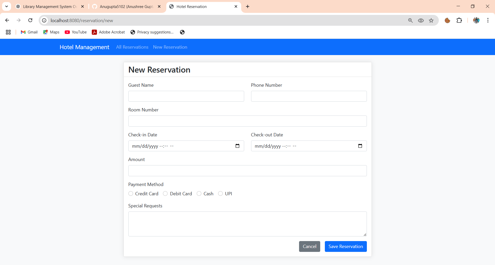

# Hotel-Management-System 🏨

## Overview
The **Hotel-Management-System** is a robust **Spring Boot** web application that streamlines hotel operations like room reservations, guest management, and role-based access. It uses **MySQL** for backend data storage and **Thymeleaf** for the frontend view layer. The system is built to increase management efficiency by up to **60%**.

---

## Features ✨

- ✅ **Admin Dashboard** for complete control over hotel operations  
- ✅ **Admin Authentication & Authorization** with Spring Security 🔐 
- ✅ **Room Booking & Reservation Management** 🛏️  
- ✅ **Guest Information Handling** 👤  
- ✅ **Real-time Room Availability Check**  
- ✅ **Payment Handling (Simulation)** 💳  
- ✅ **Spring Boot + Thymeleaf UI**  
- ✅ **CSRF protection + session security**  

---

## Screenshots 📸

| Login | Dashboard |
|-----------|------------------|
|  |  |

| Home | Reservations |
|-----------|------------------|
|  |  |

| Rooms | Guest List |
|-----------|------------------|
|  |  |

| Reservation Form | Payment Form |
|--------------|------------|
|  |  |

---

## Technologies Used 🛠️

| Layer        | Tech Stack                     |
|--------------|--------------------------------|
| Backend      | Java, Spring Boot, Spring MVC, Spring Security |
| Frontend     | Thymeleaf, HTML5, CSS3, Bootstrap |
| Database     | MySQL + Spring Data JPA        |
| Build Tool   | Maven                          |
| IDE          | IntelliJ / VS Code             |
| Security     | Spring Security (form login + session-based) |

---

## Database Schema 📊

The database contains these main tables:

| Table Name     | Description                          |
|----------------|--------------------------------------|
| `admins`       | Stores admin user credentials        |
| `guests`       | Contains guest details               |
| `rooms`        | Room configuration and availability  |
| `reservations` | Booking and reservation information  |
| `user`         | Registered user data (if enabled)    |

---

## Setup Instructions 🚀

 

### 2️⃣ Configure Database
Update `src/main/resources/application.properties`:
```properties
spring.datasource.url=jdbc:mysql://localhost:3306/hotel_management
spring.datasource.username=root
spring.datasource.password=yourpassword
spring.jpa.hibernate.ddl-auto=update
spring.h2.console.enabled=true
spring.thymeleaf.cache=false
```

Then, create the database:
```sql
CREATE DATABASE hotel_management;
```

### 3️⃣ Build and Run the Application
```bash
mvn clean install
mvn spring-boot:run
```

---

## Access URLs 🌐

| Purpose           | URL                                |
|-------------------|-------------------------------------|
| Home Page         | `http://localhost:8080/`            |
| Admin Login       | `http://localhost:8080/admin/login` |
| Admin Dashboard   | `http://localhost:8080/admin/dashboard` |
| Reservations List | `http://localhost:8080/reservations` |
| Guest Panel       | `http://localhost:8080/admin/guests` |

---

## API Endpoints 🔗

| Method | Endpoint                | Description                    |
|--------|--------------------------|--------------------------------|
| GET    | `/reservations`         | View all reservations          |
| GET    | `/reservation/new`      | Create new reservation form    |
| POST   | `/reservation/save`     | Save reservation               |
| GET    | `/reservation/payment/{id}` | Load payment screen        |
| POST   | `/reservation/payment/process` | Process payment         |
| GET    | `/admin/rooms`          | Admin: View/manage rooms       |
| GET    | `/admin/guests`         | Admin: View/manage guests      |
| POST   | `/admin/rooms/save`     | Admin: Add or update a room    |

---

## Contribution Guidelines 🤝

1. Fork the repo 🍴 
2. Create a branch: `git checkout -b feature/your-feature-name`  
3. Make your changes and commit: `git commit -m 'Add your message here'`  
4. Push the branch: `git push origin feature/your-feature-name`  
5. Create a Pull Request 📩

---

 
🌟 **Star this repo if you find it useful or learned something new!**  
✨ Happy coding! 🧡
